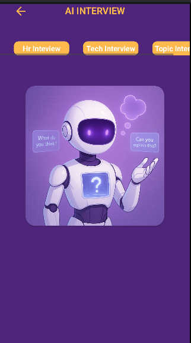
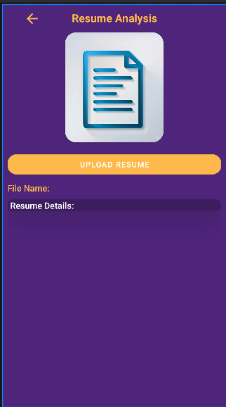

# BrainBuzz – Smart Quiz & Learning App

## Overview
BrainBuzz is an interactive quiz and learning application designed to help users enhance their aptitude and core subject knowledge. The app provides real-time feedback, AI-powered assistance, and YouTube video search integration to improve the learning experience. It supports Firebase integration for secure authentication and real-time quiz management.

With an AI chatbot, BrainBuzz allows users to ask questions and get instant responses, making the app a comprehensive learning assistant. The app is designed with a user-friendly Kotlin-based UI and follows the **MVVM (Model-View-ViewModel)** architecture for better scalability and maintainability.

---

## Features
✅ **Aptitude & Core Subject Quizzes** – Offers a wide range of quizzes covering BTech core subjects and aptitude tests.  
✅ **AI Chatbot Integration** – Users can ask questions, and the AI provides instant answers using Machine Learning (ML) models.  
✅ **YouTube Video Search** – Users can enter a query, and the app fetches the most relevant YouTube videos to aid learning.  
✅ **Real-Time Data Synchronization** – Firebase ensures secure storage, result tracking, and quiz updates.  
✅ **User Progress Tracking** – Monitors user performance and provides insights into strengths and weaknesses.  
✅ **Bookmark & Review** – Users can save questions for later review and revisit incorrect answers.  
✅ **Dark Mode Support** – Provides a comfortable learning experience during nighttime.  
✅ **Offline Mode** – Allows users to access previously attempted quizzes without an internet connection.  
✅ **Interactive UI & Smooth Navigation** – Built with `ConstraintLayout` and `RecyclerView` for an intuitive user experience.

✅ **AI Resume Analysis** – Analyzes uploaded resumes and automatically generates relevant interview questions based on the candidate's profile.

✅ **AI Mock Interview** – Simulates interview sessions with AI to help users practice and receive feedback on their responses.

---

## Technologies Used

### **Android Development & UI**
🔹 **Kotlin & XML** – Developed using Kotlin with XML layouts for a smooth and intuitive UI.  
🔹 **ConstraintLayout & RecyclerView** – Optimized UI with dynamic quiz lists and interactive screens.  
🔹 **ViewModel & LiveData** – Implemented MVVM architecture for better state management and performance.

### **Backend & Database**
🔹 **Firebase Firestore** – Used for real-time quiz data storage and user progress tracking.  
🔹 **Firebase Authentication** – Enables secure login and signup for users.  
🔹 **Cloud Functions (Optional)** – Handles AI chatbot and ML-based responses on the server.

### **API Integrations**
🔹 **Retrofit** – Used for API calls to fetch AI chatbot responses and YouTube video recommendations.  
🔹 **YouTube Data API** – Fetches top video results for user-entered queries.  
🔹 **OpenAI API/Dialogflow** – AI chatbot integration to provide real-time answers to users’ questions.

### **Machine Learning & AI**
🔹 **Scikit-Learn & TensorFlow Lite** – Implements ML models for intelligent chatbot responses.  
🔹 **Natural Language Processing (NLP)** – Enhances AI chatbot understanding for better interactions.

---

## How It Works

### 1️⃣ User Authentication
✔ Users can sign up using an email and password.  
✔ Firebase Authentication manages user login and verification.

### 2️⃣ Quiz Selection & Answering
✔ Users select quizzes based on categories (Aptitude, Core Subjects, etc.).  
✔ Each quiz has multiple-choice questions (MCQs) with a timer.

### 3️⃣ AI Chatbot Interaction
✔ Users can type questions, and the AI chatbot provides real-time answers.  
✔ The chatbot suggests relevant YouTube videos for further explanation.

### 4️⃣ Performance Tracking & Review
✔ Firebase stores quiz history and tracks user performance.  
✔ Users can review incorrect answers and improve over time.

---

## Future Enhancements 🚀
🔹 **Leaderboard & Rewards** – Users can compete for top rankings and badges.  
🔹 **Voice-Based Chatbot** – Users can speak queries for AI responses.  
🔹 **Personalized Quiz Recommendations** – AI suggests quizzes based on past performance.  
🔹 **Multiplayer Quiz Mode** – Compete with friends in real time.  
🔹 **Daily Quiz Challenges** – New quizzes updated every day for learning motivation.

---
## Screenshots

<table>
  <tr>
    <td></td>
    <td></td>
    <td></td>
  </tr>
  <tr>
    <td><b>Home Screen</b></td>
    <td><b>Splash Screen</b></td>
    <td><b>Login Screen</b></td>
  </tr>
  <tr>
    <td></td>
    <td></td>
    <td></td>
  </tr>
  <tr>
    <td><b>Sign Up Screen</b></td>
    <td><b>Forgot Password</b></td>
    <td><b>Question Screen</b></td>
  </tr>
  <tr>
    <td></td>
     <td></td>
     <td></td>
  </tr>
  <tr>
    <td><b>AI Chatbot Screen</b></td>
    <td><b>AI Interview Screen</b></td>
    <td><b>AI Resume Analysis Screen</b></td>
  </tr>
</table>

